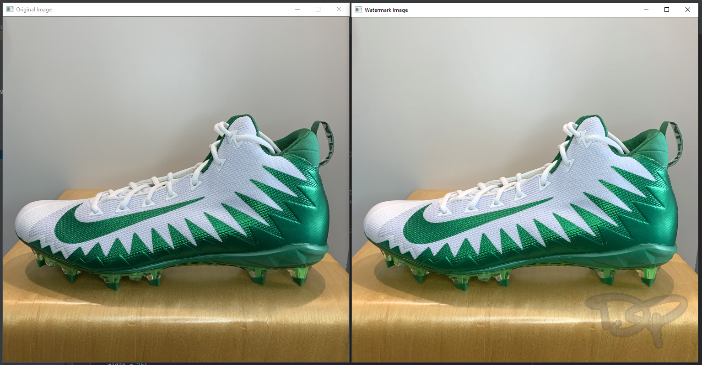

# Add watermark to an image using opencv

Python script to add a transparent watermark to an existing image using opencv

```bash
Usage:
    add_wm.py [options]
Options:
    -h --help                      Show this text.
    -d --dir <directory images>    directory to watermark
```

<p align="left">
    <a href="https://www.python.org/" alt="Made with python">
        </a>
</p>


